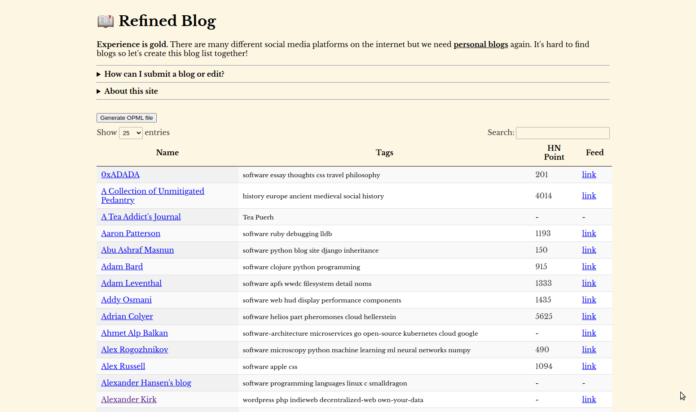

The domain for refined.blog has expired and I would like to host the project at https://m8.github.io/refined.blog/.

# refined.blog

 

Experience is gold. There are many different social media platforms on the internet but we need personal blogs again. It's hard to find blogs so let's create this blog list together! 

* **[See refined.blog](https://m8.github.io/refined.blog/)**
* [See Contribution Guideline](contributing.md)

